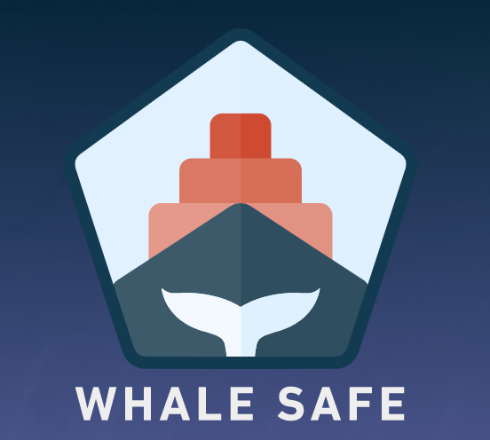

# WhaleSafe BigQuery SQL
Execute SQL to process Global Fishing Watch AIS messages data into geospatial data and produce vessel speed reduction statistics.

## Setup Python

Get BigQuery Client Libraries:

- https://cloud.google.com/bigquery/docs/reference/libraries

FYI, here's the google cloud python development setup:

- https://cloud.google.com/python/setup

Essentially:

1. Install the latest version of Python.
2. Use `venv` to isolate dependencies.
3. Install an editor (optional).
4. Install the Cloud SDK (optional).
5. Install the Cloud Client Libraries for Python (optional).
6. Install other useful tools.

## Run Queries

Setup BigQuery Project and utilize SQL in queries folder to create and update tables in a BQ dataset.

0. Ensure you have created a BigQuery project and a dataset that matches SQL queries in query folder. ex) our dataset is called "whalesafe_v2." Also, ensure starting AIS data has correct schema. Finally, ensure you have VSR zone data (vsr_zones), ownership data (ihs_data), and shoreline data (in our case, us_medium_coastline).

1. Update AIS data (BOI uses GFWW's AIS data pipeline, permissions are required.)
2. Update AIS segments data table.
3. Update AIS segments aggregated data (optional). Useful for visualization
4. Intersect AIS segments data with Vessel Speed Reduction zone by date range and spatially.
5. Calculate statistics for each mmsi (vessel), grouped by day, month, and year.
6. Calculate statistics for each operator (owner of a fleet), grouped by day, month, and year.

